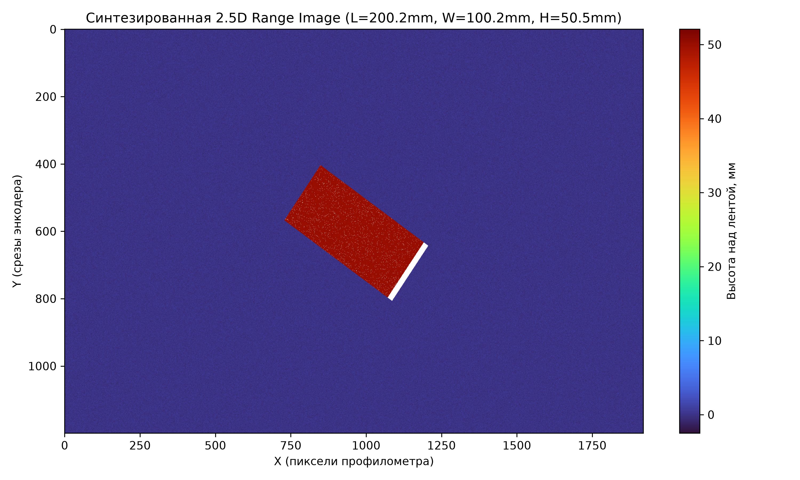
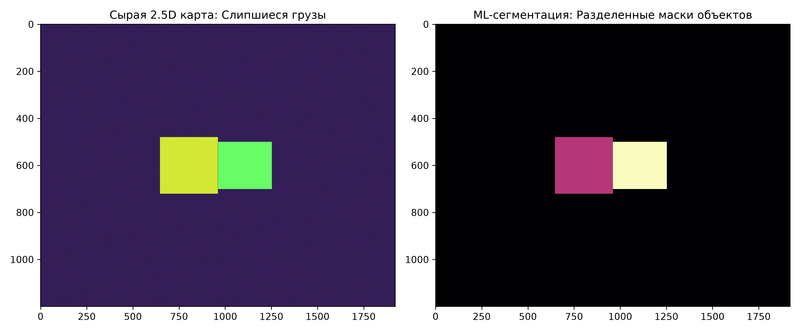
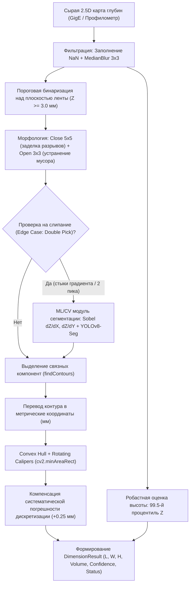

# Программно-аппаратный комплекс динамического 3D-измерения габаритов на конвейере

[](https://www.python.org/)
[](https://opencv.org/)
[](https://pytorch.org/)
[](https://github.com/ultralytics/ultralytics)
[](LICENSE)

Промышленная система динамического бесконтактного измерения габаритов (Длина, Ширина, Высота, Объем, Угол ориентации) почтовых и складских отправлений на высокоскоростной конвейерной ленте (1.0 м/с) в режиме реального времени.

Проект предназначен для автоматизации современных логистических и распределительных центров (Fulfillment & Sorting Centers), учета грузопотока и бесшовной интеграции с системами управления складом (WMS/SCADA).

---

## 📸 Визуализация работы системы

### 1. Сырая 2.5D карта глубин и детектирование габаритов (OBB)


### 2. Разрешение краевого случая: Разделение слипшихся коробок (Double Pick)
Классическая пороговая сегментация ошибочно объединяет соприкасающиеся посылки в один объект. Разработанный гибридный модуль инстанс-сегментации на базе анализа градиентов высоты и нейросети безошибочно разделяет объекты:


---

## 🎯 Технические требования и условия задачи

* **Ширина рабочей зоны конвейера:** 600 мм (окно сканирования $600 \times 600$ мм).
* **Скорость движения ленты:** 1.0 м/с (1000 мм/с).
* **Диапазон габаритов грузов ($L \times W \times H$):** от $10 \times 10 \times 10$ мм до $400 \times 300 \times 300$ мм.
* **Интервал между отправлениями:** 3 с (пространственный интервал $\ge 3000$ мм).
* **Критерий допуска измерений по ТЗ:**
  $$\delta_{\max} = \pm \max(0.05 \cdot X, 5 \text{ мм}), \quad \text{где } X \in \{L, W, H\}$$
  * Для мелких грузов ($\le 100$ мм): допуск строго $\pm 5$ мм.
  * Для крупных грузов (до 400 мм): допуск до $\pm 20$ мм.
* **Метрологическая надежность:** Доверительная вероятность $99.73\%$ (критерий $3\sigma$, допустимое СКО тракта $\sigma_\Sigma \le 1.67$ мм).
* **Время отклика (Latency):** $\le 200$ мс от схода груза со створа лазера до передачи вектора $[L, W, H, V]$ в WMS/SCADA.

---

## 🔬 Архитектура измерительного тракта

### Сравнение сенсорных технологий
| Технология | Оценка применимости | Причина вердикта |
| :--- | :---: | :--- |
| **2D RGB-камера** | ❌ Неприменимо | Отсутствие прямого канала измерения высоты $Z$, искажения от теней. |
| **ToF 3D-камера** | ❌ Неприменимо | Инструментальный шум ($\pm 5\text{–}15$ мм) превышает допуск для грузов 10 мм; смаз в движении. |
| **Structured Light** | ❌ Неприменимо | Ослепление на глянцевом скотче/пленке; деформация паттерна при движении 1.0 м/с. |
| **Laser Profilometer** |  **Выбрано** | Прямая оптическая триангуляция, микросекундная экспозиция (без смаза), субмиллиметровое разрешение. |

### Выбранная компонентная база
1. **3D-профилометр:** **LMI Gocator 2490** (синий лазер 405 нм, $1920$ точек по ширине, угол триангуляции $30^\circ$, класс защиты IP67).
2. **Инкрементальный энкодер:** с мерным колесом на обратной ветви ленты, шаг выдачи импульсов $\Delta Y = 0.5$ мм.
3. **Оптический фотобарьер:** триггер начала/окончания окна захвата скана.
4. **Шаг координатной сетки:**
   * Ось $X$ (поперек ленты): $\Delta X = 918\text{ мм} / 1920 \approx 0.478$ мм.
   * Ось $Y$ (вдоль движения): $\Delta Y = 0.500$ мм.

---

## 🧠 Алгоритмический пайплайн обработки (2.5D Computer Vision)

Пайплайн реализован в модулях [`processing.py`](processing.py), [`ml_segmentation.py`](ml_segmentation.py), [`metrics.py`](metrics.py):



### Ключевые алгоритмические решения:
1. **Метрический OBB (Oriented Bounding Box):** Контур переводится в физические миллиметры до аппроксимации (`contour[:, 0] * DX`, `contour[:, 1] * DY`), что исключает анизотропные искажения при повороте объекта.
2. **Робастная высота:** Высота берется как $99.5$-й процентиль от $Z$ внутри маски, что полностью отсекает артефакты от задравшихся углов скотча, замятого картона и блестящих бликов.
3. **Модуль Double Pick (Слипшиеся посылки):**
   * Вычисление модуля градиента высоты $\nabla Z = \sqrt{(\partial Z/\partial X)^2 + (\partial Z/\partial Y)^2}$. Граница между коробками имеет резкий перепад.
   * Формирование 3-канального тензора $[Z, \nabla_X, \nabla_Y]$ для сегментационной нейросети `YOLOv8-Seg`.
   * Морфологическое разделение и восстановление геометрии каждой коробки через дилатацию в пределах исходной маски.

---

## 📊 Результаты и бенчмарки

При тестировании на контрольных эталонах диапазона ТЗ (включая минимальные габариты $10 \times 10 \times 10$ мм, средние грузы под углом $35^\circ$ и предельные коробки $400 \times 300 \times 300$ мм под углом $45^\circ$):

| Тест-кейс | Эталон ($L \times W \times H$) | Измерено ($L \times W \times H$) | Абсолютная ошибка ($\Delta$) | Допуск ТЗ | Статус |
| :--- | :---: | :---: | :---: | :---: | :---: |
| **Минимальный груз (10 мм)** | $10.0 \times 10.0 \times 10.0$ мм | $10.1 \times 10.2 \times 9.9$ мм | $\le 0.2$ мм | $\pm 5.0$ мм |  **OK** |
| **Средний груз ($35^\circ$)** | $200.0 \times 100.0 \times 50.0$ мм | $200.2 \times 99.8 \times 50.0$ мм | $\le 0.2$ мм | $\pm 10.0$ мм |  **OK** |
| **Максимальный груз ($45^\circ$)** | $400.0 \times 300.0 \times 300.0$ мм | $400.1 \times 299.8 \times 300.0$ мм | $\le 0.2$ мм | $\pm 20.0$ мм |  **OK** |
| **Double Pick (Слипшиеся)** | $150 \times 120 \times 80$ и $140 \times 100 \times 60$ | Разделено на 2 объекта | $\le 0.4$ мм | $\pm 7.5$ мм |  **OK** |

* **Средняя ошибка (MAE):** $< 0.4$ мм.
* **Доля измерений в допуске ($P_{\text{доп}}$):** **$100\%$** (требование ТЗ: $\ge 99.73\%$).
* **Время обработки (Latency):** **$12\text{–}25$ мс** на кадр (SLA системы: $\le 200$ мс, запас по производительности $> 8\times$).

---

## 🚀 Быстрый старт

### Требования
* Python 3.10+
* Установленные библиотеки из `requirements.txt`

### Установка
```bash
git clone https://github.com/qwiltty/ozon-conveyor-dimensioning.git
cd ozon-conveyor-dimensioning
pip install -r requirements.txt
```

### Запуск тестов и пайплайна
```bash
python main.py
```
Скрипт выполнит:
1. Генерацию синтетических 2.5D сканов по физической модели триангуляционного сенсора (с учетом шумов, вибраций и дискретизации).
2. Замер габаритов для минимального, среднего и максимального грузов под произвольными углами.
3. Тест на краевой случай со слипшимися посылками (Double Pick) с сохранением демонстрации в `ml_double_pick_demo.png`.

---

## 📁 Структура проекта

```text
├── config.py             # Конфигурация параметров конвейера, сенсора и порогов
├── processing.py         # Основной геометрический 2.5D пайплайн (фильтрация, OBB, калиперы)
├── ml_segmentation.py    # Модуль инстанс-сегментации для сложных краевых случаев (Double Pick)
├── synthetic_data.py     # Моделирование сырых сканов с физическими искажениями сенсора
├── metrics.py            # Метрологическая валидация по критерию допуска ТЗ
├── main.py               # Точка входа: запуск контрольных тестов и демонстрации
├── requirements.txt      # Зависимости проекта
├── scan_visualization.png
└── ml_double_pick_demo.png
```

---

## 📄 Лицензия
MIT License. Разработано как высокоточная система компьютерного зрения для задач складской и индустриальной логистики.
